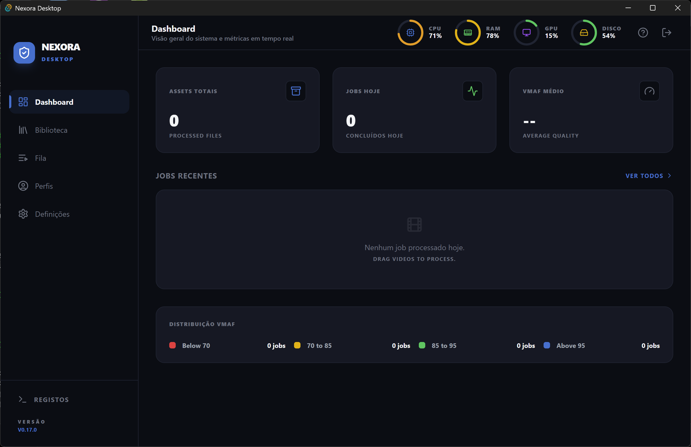
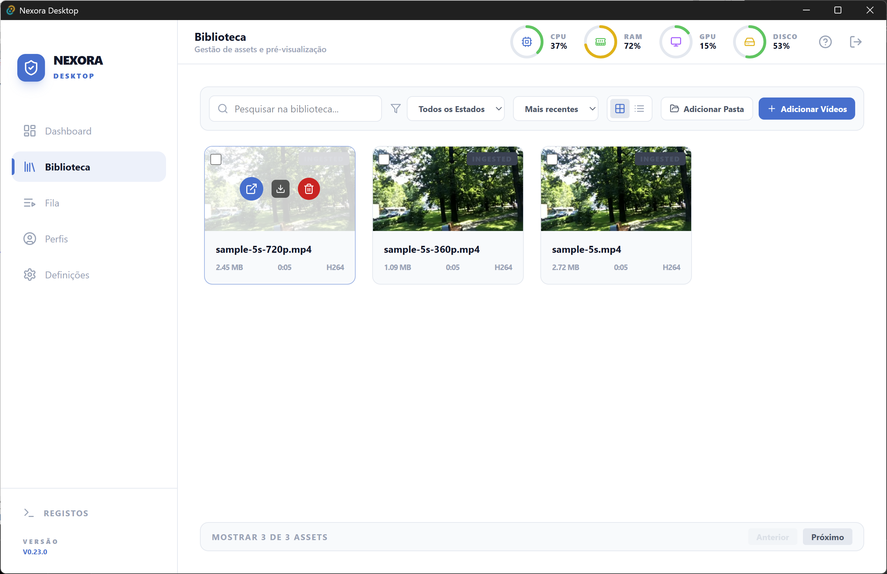
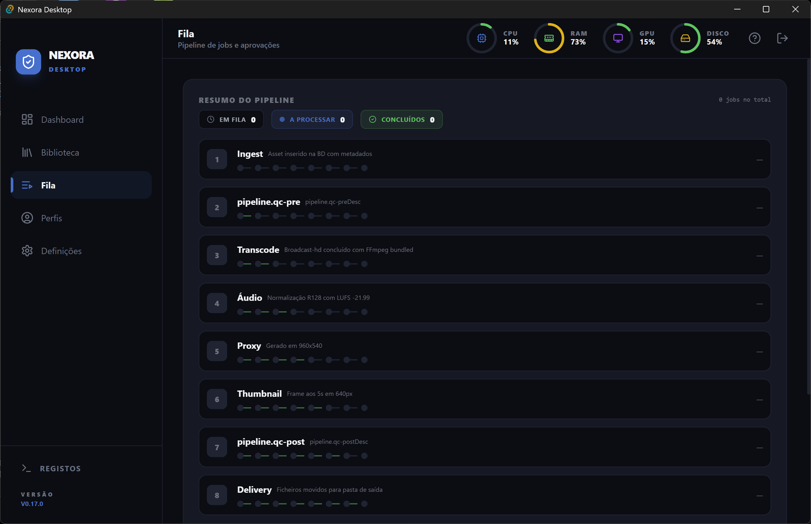
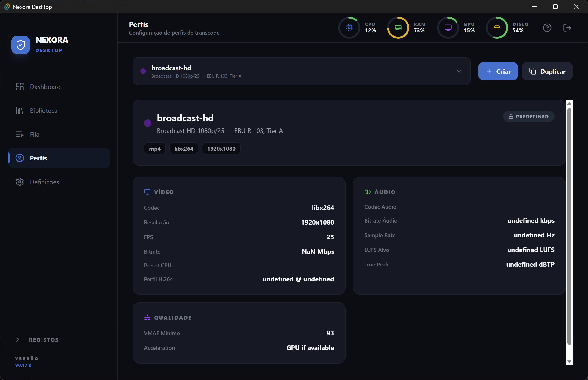
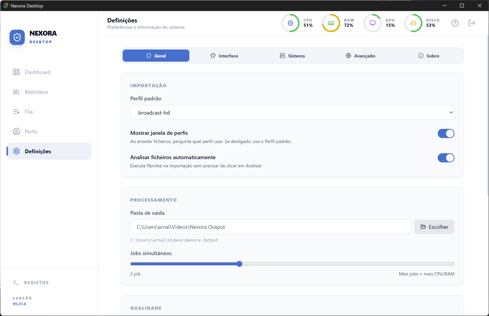
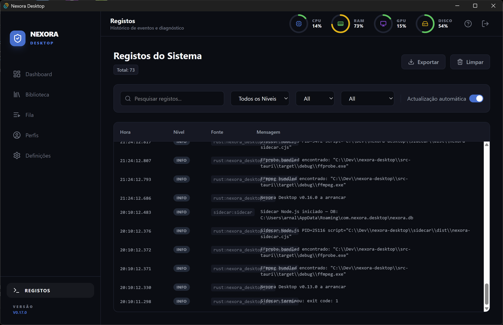

# Nexora Desktop

<p align="center">
  
</p>

<h1 align="center">Nexora Desktop</h1>
<p align="center">
  <strong>Native Multiplatform Media Processing</strong><br>
  Professional video transcoding, quality control, and delivery preparation — built for broadcast and web workflows.
</p>

<p align="center">
  <a href="https://github.com/ideiasestrondosas-ctrl/nexora-desktop/releases/latest">
    
  </a>
  <a href="#platforms">
    
  </a>
  <a href="docs/LICENSE.md">
    
  </a>
  <a href="https://github.com/ideiasestrondosas-ctrl/nexora-desktop/actions">
    
  </a>
</p>

---

## Table of Contents

- [Overview](#overview)
- [Features](#features)
- [Screenshots](#screenshots)
- [Architecture](#architecture)
- [Installation](#installation)
- [Quick Start](#quick-start)
- [Transcoding Profiles](#transcoding-profiles)
- [Keyboard Shortcuts](#keyboard-shortcuts)
- [Documentation](#documentation)
- [Development](#development)
- [Contributing](#contributing)
- [License](#license)

---

## Overview

**Nexora Desktop** is a native, multiplatform desktop application for professional media processing. Built with [Tauri 2.x](https://tauri.app) (Rust backend), [React 19](https://react.dev) (frontend), and a Node.js sidecar, it delivers a fast, secure, and lightweight experience across Windows, macOS, and Linux.

Whether you are preparing content for broadcast, web streaming, or social media, Nexora provides a complete pipeline: ingest, quality control, GPU-accelerated transcoding, audio normalization, proxy generation, thumbnail extraction, post-QC with VMAF, and final delivery.

### Supported Languages

Nexora supports **15 languages**: English, Portuguese, Spanish, French, German, Italian, Japanese, Korean, Dutch, Polish, Russian, Swedish, Turkish, Arabic, and Chinese.

---

## Features

| Feature                         | Description                                                                           |
| ------------------------------- | ------------------------------------------------------------------------------------- |
| **GPU-Accelerated Transcoding** | Auto-detects NVIDIA NVENC, AMD AMF, Intel QSV, or falls back to CPU (libx264)         |
| **8-Stage Pipeline**            | Ingest → QC-Pre → Transcode → Audio → Proxy → Thumbnail → QC-Post → Delivery          |
| **VMAF Quality Scoring**        | Perceptual quality measurement comparing source vs. output                            |
| **EBU R128 Loudness**           | Broadcast-standard audio normalization with true peak limiting                        |
| **QC Quarantine**               | Automatic quarantine of files failing pre-QC checks; manual approve/reject workflow   |
| **6 System Profiles**           | Broadcast HD/SD, Web 4K/HD, Proxy, Social — plus custom profile editor                |
| **Real-Time Monitoring**        | Live job queue with visual pipeline, progress bars, system metrics (CPU/RAM/GPU/Disk) |
| **Drag & Drop Ingest**          | Native file drop from anywhere on the OS; supports MP4, MKV, MOV, MXF, AVI, WebM      |
| **Multi-Language UI**           | Full i18n with 15 languages; theme switching (System / Light / Dark)                  |
| **Auto-Updater**                | Built-in Tauri updater checks GitHub releases automatically                           |
| **Native Notifications**        | System-level notifications for job completion, errors, and quarantine alerts          |
| **Comprehensive Logging**       | Structured logs with filtering by level, source, and time range; exportable           |
| **Factory Reset**               | One-click reset to defaults, preserving or wiping all data                            |

---

## Screenshots

> Replace the placeholders below with actual screenshots from your installation.

| Dashboard                                    | Library                                             | Queue                                             |
| -------------------------------------------- | --------------------------------------------------- | ------------------------------------------------- |
|  |             |               |
| System overview with stats and recent jobs   | Asset management with grid/list views and drag-drop | Real-time job monitoring with pipeline visualizer |

| Profiles                                   | Settings                                   | Asset Detail                                       |
| ------------------------------------------ | ------------------------------------------ | -------------------------------------------------- |
|  |  |  |
| Transcode profile editor with presets      | System configuration and diagnostics       | Deep-dive into asset metadata and QC reports       |

---

## Architecture

```
┌─────────────────────────────────────────────────────────────┐
│                      NEXORA DESKTOP                         │
├─────────────────────┬───────────────────────────────────────┤
│   React 19 Frontend │   Tauri 2.x (Rust)                    │
│   • Dashboard       │   • Commands (IPC)                    │
│   • Library         │   • SQLite Database                   │
│   • Queue           │   • System Metrics                    │
│   • Profiles        │   • GPU Detection                     │
│   • Settings        │   • File I/O                          │
│   • Logs            │   • Native Notifications              │
│   • Asset Detail    │   • Auto-Updater                      │
├─────────────────────┴───────────────────────────────────────┤
│              Node.js Sidecar (per job)                      │
│   Ingest → QC-Pre → Transcode → Audio → Proxy → Thumbnail → QC-Post → Delivery │
└─────────────────────────────────────────────────────────────┘
```

### Pipeline Stages

1. **Ingest** — SHA-256 hash, ffprobe metadata extraction (5%)
2. **QC-Pre** — File validation, unsupported codec detection (5%)
3. **Transcode** — GPU/CPU encoding with profile settings (50%)
4. **Audio** — EBU R128 loudness normalization (15%)
5. **Proxy** — Low-res proxy generation for preview (10%)
6. **Thumbnail** — Keyframe extraction at 5s or mid-duration (3%)
7. **QC-Post** — SHA-256 verification, VMAF quality scoring (7%)
8. **Delivery** — Copy final file to output directory (5%)

---

## Installation

### Download

Get the latest release from the [Releases](https://github.com/ideiasestrondosas-ctrl/nexora-desktop/releases) page.

| Platform    | Installer                                | Size    |
| ----------- | ---------------------------------------- | ------- |
| **Windows** | `.msi` (recommended) or `.exe` (NSIS)    | ~150 MB |
| **macOS**   | `.dmg` (Universal Intel + Apple Silicon) | ~180 MB |
| **Linux**   | `.deb` (Debian/Ubuntu) or `.AppImage`    | ~120 MB |

### System Requirements

|             | Minimum                              | Recommended                               |
| ----------- | ------------------------------------ | ----------------------------------------- |
| **OS**      | Windows 10 / macOS 11 / Ubuntu 20.04 | Windows 11 / macOS 14 / Ubuntu 22.04      |
| **CPU**     | 64-bit dual-core                     | 64-bit quad-core or better                |
| **RAM**     | 4 GB                                 | 8 GB+                                     |
| **GPU**     | Not required                         | NVIDIA (NVENC), AMD (AMF), or Intel (QSV) |
| **Disk**    | 500 MB for app + working space       | SSD with 10 GB+ free                      |
| **Network** | Optional (for updater)               | Recommended                               |

### First Launch

1. Install the application using the appropriate installer for your OS.
2. On first launch, Nexora will download FFmpeg and FFprobe binaries automatically (if not bundled).
3. Choose your **output directory** in Settings → General.
4. Select your preferred **language** and **theme** in Settings → Interface.

> For detailed installation instructions per platform, see [docs/INSTALL.md](docs/INSTALL.md).

---

## Quick Start

### 1. Ingest Media

- Go to **Library**.
- Drag and drop video files onto the window, or click **"Select Files"** to browse.
- Supported formats: `.mp4`, `.mkv`, `.mov`, `.mxf`, `.avi`, `.webm`, `.ts`, `.m2ts`.

### 2. Choose a Transcoding Profile

- Go to **Profiles**.
- Select a preset:
  - **Broadcast HD** — 1920×1080, H.264, 15 Mbps, -23 LUFS
  - **Broadcast SD** — 720×576, H.264, 5 Mbps, -23 LUFS
  - **Web 4K** — 3840×2160, H.264, 35 Mbps, -16 LUFS
  - **Web HD** — 1920×1080, H.264, 8 Mbps, -16 LUFS
  - **Proxy** — 960×540, H.264, 800 kbps (fast preview)
  - **Social** — 1080×1080, H.264, 4 Mbps, -14 LUFS
- Or create your own custom profile with the **Profile Editor**.

### 3. Submit a Job

- In the **Library**, click on an asset.
- Click **Reprocess** and select the desired profile.
- The job is added to the **Queue** automatically.

### 4. Monitor Progress

- Go to **Queue** to see the real-time pipeline.
- Each stage is visualized with color-coded indicators:
  - Green checkmark = completed
  - Blue pulse = currently processing
  - Yellow shield = quarantined (awaiting approval)
  - Red alert = error

### 5. Review Results

- When a job completes, click on the asset in **Library** to open **Asset Detail**.
- Review the **QC Report** with VMAF score, LUFS reading, and verification checks.
- Quarantined jobs appear in the **Pending Approvals** section of the Queue.

---

## Transcoding Profiles

| Profile          | Resolution | Video Codec    | Bitrate  | LUFS Target | VMAF Threshold | Use Case               |
| ---------------- | ---------- | -------------- | -------- | ----------- | -------------- | ---------------------- |
| **Broadcast HD** | 1920×1080  | H.264 High     | 15 Mbps  | -23         | 90             | TV broadcast           |
| **Broadcast SD** | 720×576    | H.264 Main     | 5 Mbps   | -23         | 90             | Legacy broadcast       |
| **Web 4K**       | 3840×2160  | H.264 High     | 35 Mbps  | -16         | 85             | Streaming UHD          |
| **Web HD**       | 1920×1080  | H.264 High     | 8 Mbps   | -16         | 85             | Web streaming          |
| **Proxy**        | 960×540    | H.264 Baseline | 800 kbps | —           | 70             | Fast preview / editing |
| **Social**       | 1080×1080  | H.264 Main     | 4 Mbps   | -14         | 80             | Social media           |

> All profiles use broadcast-standard parameters: closed GOP, no B-frames, YUV 4:2:0, and faststart for web compatibility. See [docs/USER_MANUAL.md](docs/USER_MANUAL.md) for full technical details.

---

## Keyboard Shortcuts

| Shortcut           | Action                                 |
| ------------------ | -------------------------------------- |
| `Ctrl + 1`         | Go to Dashboard                        |
| `Ctrl + 2`         | Go to Library                          |
| `Ctrl + 3`         | Go to Queue                            |
| `Ctrl + 4`         | Go to Profiles                         |
| `Ctrl + 5`         | Go to Settings                         |
| `Ctrl + L`         | Go to Logs                             |
| `Ctrl + D`         | Go to Asset Detail (if asset selected) |
| `Esc`              | Close modal / overlay / go back        |
| `F1`               | Open Help / User Manual                |
| `Ctrl + Shift + E` | Export logs                            |

> Shortcuts are contextual to the active screen. See the in-app **Help** panel (❓ button in the top-right) for screen-specific shortcuts.

---

## Documentation

| Document                                     | Description                                                  |
| -------------------------------------------- | ------------------------------------------------------------ |
| [docs/USER_MANUAL.md](docs/USER_MANUAL.md)   | Complete user guide: all screens, pipeline, QC workflow      |
| [docs/SCREEN_GUIDE.md](docs/SCREEN_GUIDE.md) | Visual guide to every screen, button, badge, and interaction |
| [docs/FUNCTIONS.md](docs/FUNCTIONS.md)       | Technical reference: commands, workers, database, hooks      |
| [docs/INSTALL.md](docs/INSTALL.md)           | Platform-specific installation and uninstallation guide      |
| [docs/LICENSE.md](docs/LICENSE.md)           | GNU General Public License v3.0                              |

---

## Development

### Prerequisites

- [Node.js](https://nodejs.org) 20+
- [Rust](https://rustup.rs) (stable)
- [Git](https://git-scm.com)

### Setup

```bash
# Clone the repository
git clone https://github.com/ideiasestrondosas-ctrl/nexora-desktop.git
cd nexora-desktop

# Install dependencies
npm install

# Run in development mode
npm run tauri dev
```

### Build

```bash
# Production build (generates installers)
npm run tauri build
```

### Run Tests

```bash
# Frontend + sidecar unit tests
npm test

# Rust checks
cd src-tauri && cargo check
```

## Development Environment

| Component    | Details                                                    |
| ------------ | ---------------------------------------------------------- |
| OS           | Windows 11 Pro (Build 26200)                               |
| IDE          | Claude Code (Anthropic) + Google Antigravity (when needed) |
| Shell        | PowerShell 7 + Bash (via Git)                              |
| Frontend     | React 19 + TypeScript + Vite                               |
| Backend      | Rust stable (Tauri 2.x)                                    |
| Media engine | Node.js 20 sidecar + FFmpeg                                |

### Project Structure

```
nexora-desktop/
├── src/                    # React 19 frontend
│   ├── pages/              # Screens (Dashboard, Library, Queue, etc.)
│   ├── components/         # Reusable UI components
│   ├── hooks/              # Custom React hooks
│   ├── store/              # Zustand state management
│   └── i18n/               # 15-language translation files
├── src-tauri/              # Tauri 2.x (Rust backend)
│   ├── src/commands/       # IPC command handlers
│   ├── src/db/             # SQLite schema and migrations
│   └── icons/              # Application icons
├── sidecar/                # Node.js sidecar (workers + orchestrator)
│   ├── workers/            # 8 pipeline workers
│   └── profiles/           # Transcoding profile definitions
├── tests/                  # Vitest test suite
├── scripts/                # Build, setup, and utility scripts
└── docs/                   # Documentation
```

---

## Contributing

Contributions are welcome! Please:

1. Fork the repository.
2. Create a feature branch (`git checkout -b feat/my-feature`).
3. Commit your changes following [Conventional Commits](https://www.conventionalcommits.org).
4. Push to your fork and open a Pull Request.

For questions or bug reports, please use the [GitHub Issues](https://github.com/ideiasestrondosas-ctrl/nexora-desktop/issues) page.

---

## License

This project is licensed under the **GNU General Public License v3.0**.

See [docs/LICENSE.md](docs/LICENSE.md) for the full license text.

---

## AI Tools & Development Assistance

This project was developed with the assistance of AI coding tools:

- **[Claude Code](https://claude.ai/code)** (Anthropic) — primary development assistant: architecture, implementation, code review, and documentation
- **[Google Antigravity](https://antigravity.dev)** — supplementary AI assistance when needed

These tools were used for pair-programming, not for autonomous code generation without review.

---

<p align="center">
  Built with ❤️ using <a href="https://tauri.app">Tauri</a>, <a href="https://react.dev">React</a>, and <a href="https://www.rust-lang.org">Rust</a>.
</p>
