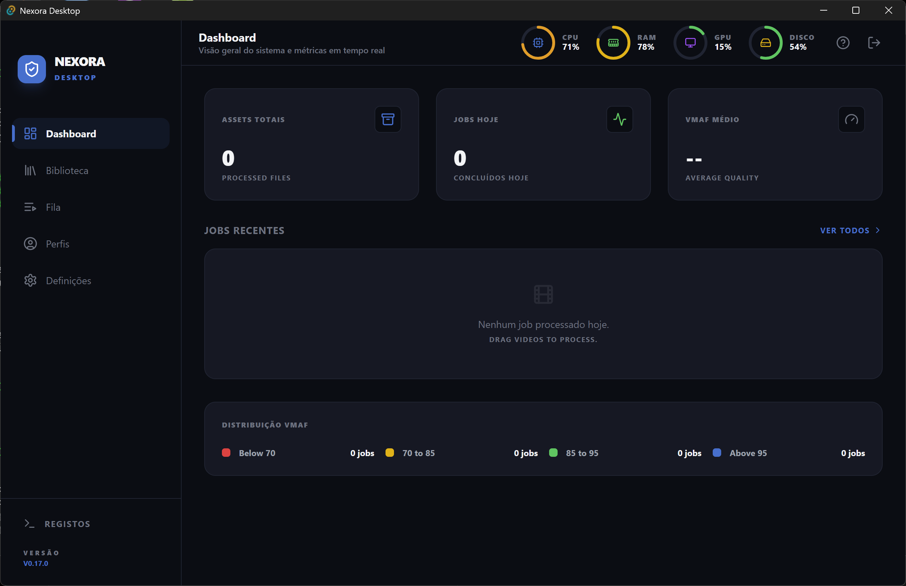
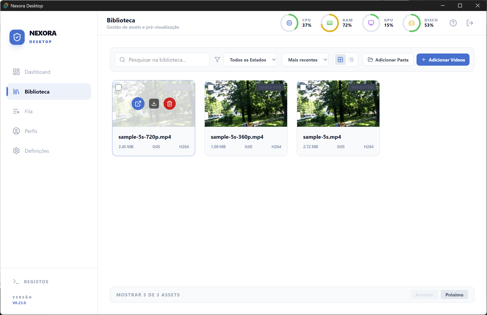
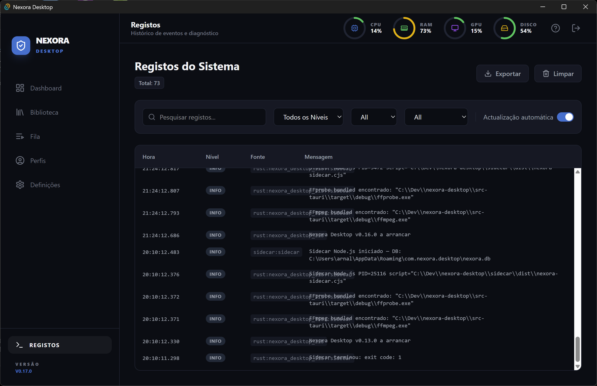
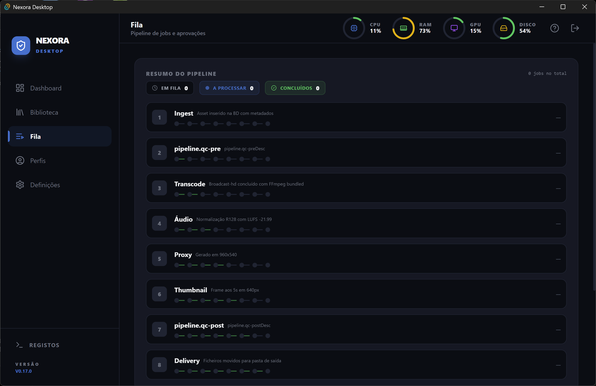
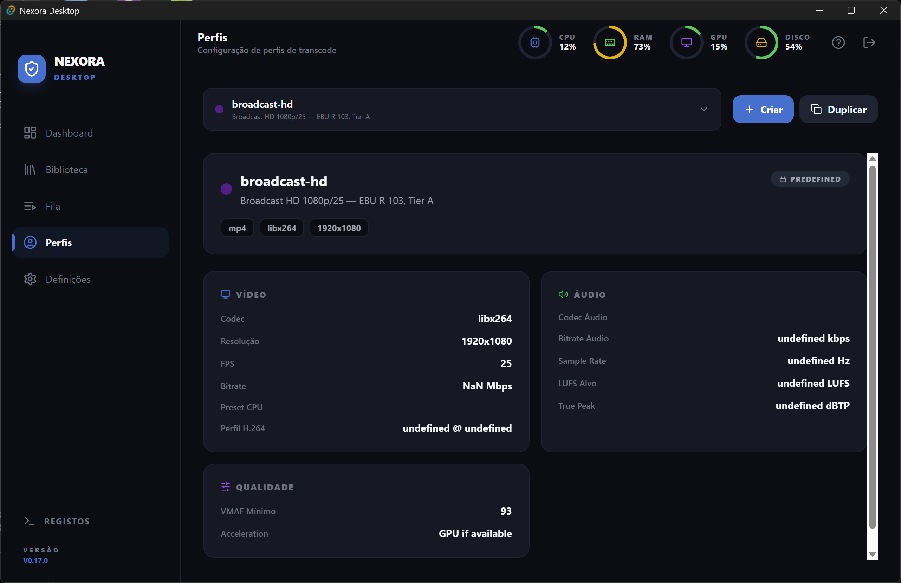
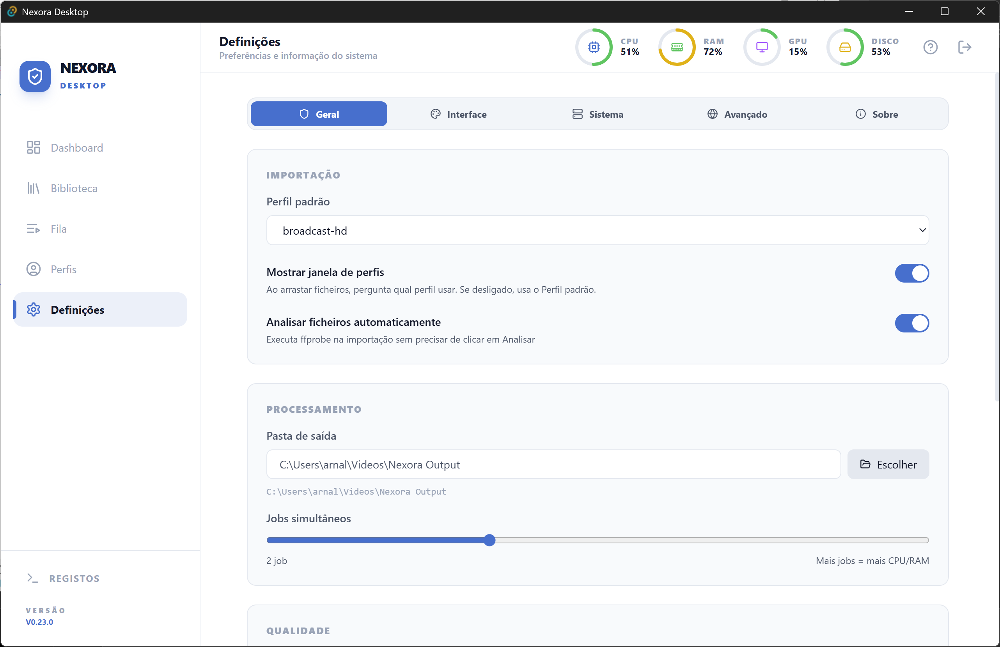
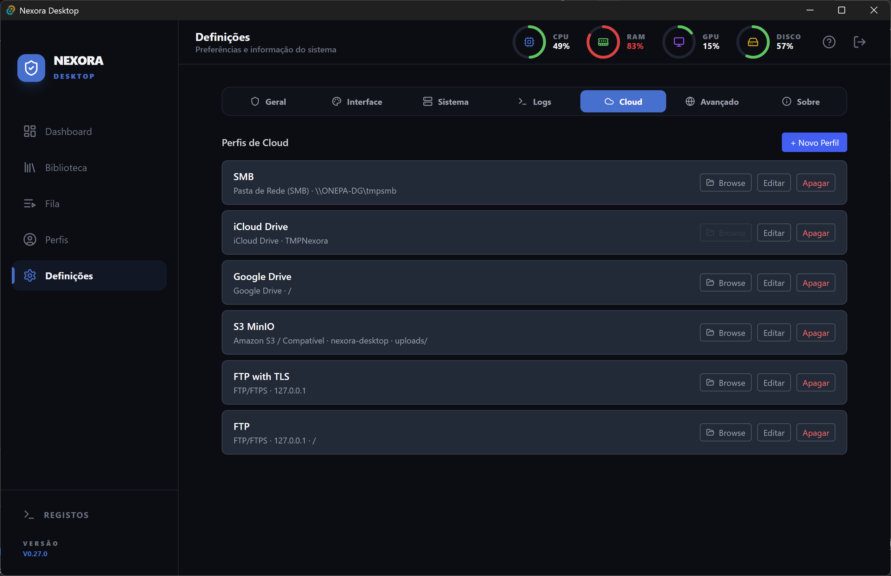
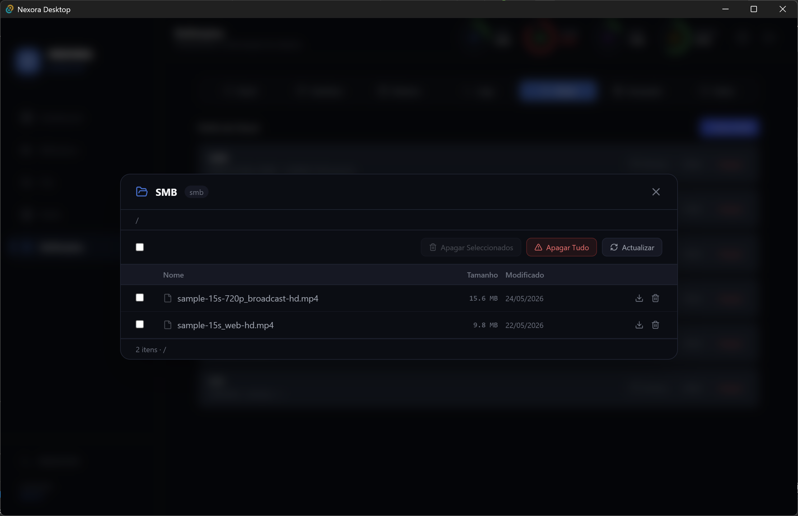
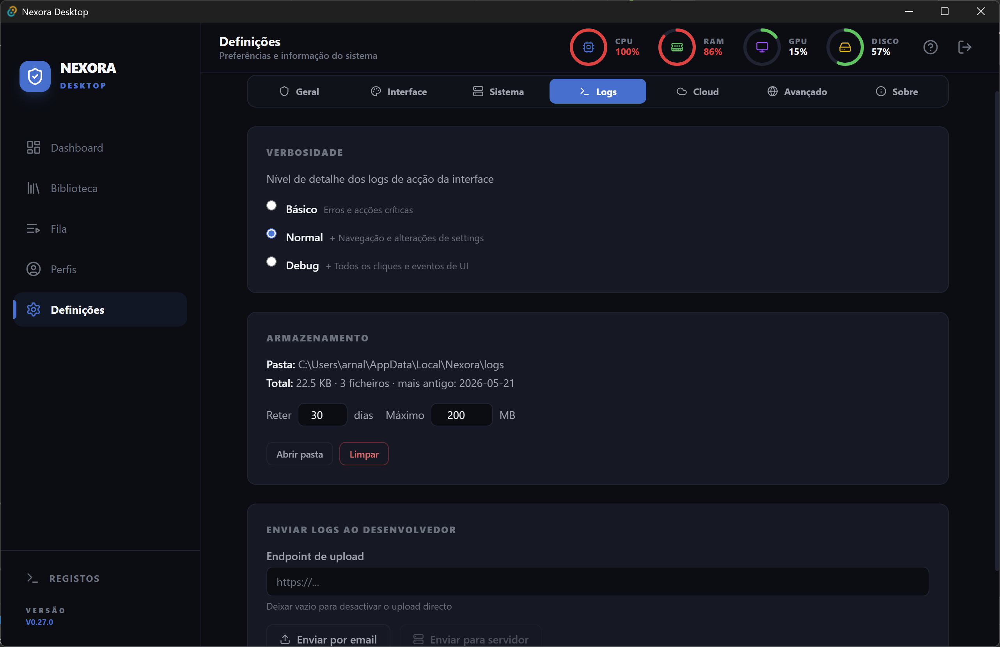

# Nexora Desktop

<p align="center">
  
</p>

<h1 align="center">Nexora Desktop</h1>
<p align="center">
  <strong>Native Multiplatform Media Processing</strong><br>
  Professional video transcoding, quality control, and delivery preparation — built for broadcast and web workflows.
</p>

<p align="center">
  <a href="https://github.com/ideiasestrondosas-ctrl/nexora-desktop/releases/latest">
    
  </a>
  <a href="#platforms">
    
  </a>
  <a href="docs/LICENSE.md">
    
  </a>
  <a href="https://github.com/ideiasestrondosas-ctrl/nexora-desktop/actions">
    
  </a>
</p>

---

## Table of Contents

- [Overview](#overview)
- [Features](#features)
- [Screenshots](#screenshots)
- [Architecture](#architecture)
- [Installation](#installation)
- [Quick Start](#quick-start)
- [Transcoding Profiles](#transcoding-profiles)
- [Keyboard Shortcuts](#keyboard-shortcuts)
- [Nexora QA Runner](#nexora-qa-runner)
- [Documentation](#documentation)
- [Development](#development)
  - [Dev Environment Optimizer](#dev-environment-optimizer)
- [Contributing](#contributing)
- [License](#license)

---

## Overview

**Nexora Desktop** is a native, multiplatform desktop application for professional media processing. Built with [Tauri 2.x](https://tauri.app) (Rust backend), [React 19](https://react.dev) (frontend), and a Node.js sidecar, it delivers a fast, secure, and lightweight experience across Windows, macOS, and Linux.

Whether you are preparing content for broadcast, web streaming, or social media, Nexora provides a complete pipeline: ingest, quality control, GPU-accelerated transcoding, audio normalization, proxy generation, thumbnail extraction, post-QC with VMAF, and final delivery.

### Supported Languages

Nexora supports **15 languages**: English, Portuguese, Spanish, French, German, Italian, Dutch, Polish, Russian, Chinese (Simplified), Chinese (Traditional), Japanese, Korean, Arabic, and Hindi.

---

## Features

| Feature                         | Description                                                                                                                                       |
| ------------------------------- | ------------------------------------------------------------------------------------------------------------------------------------------------- |
| **GPU-Accelerated Transcoding** | Auto-detects NVIDIA NVENC, AMD AMF, Intel QSV, or falls back to CPU (libx264)                                                                     |
| **8-Stage Pipeline**            | Ingest → QC-Pre → Transcode → Audio → Proxy → Thumbnail → QC-Post → Delivery                                                                      |
| **VMAF Quality Scoring**        | Perceptual quality measurement comparing source vs. output                                                                                        |
| **EBU R128 Loudness**           | Broadcast-standard audio normalization with true peak limiting                                                                                    |
| **QC Quarantine**               | Automatic quarantine of files failing pre-QC checks; manual approve/reject workflow                                                               |
| **6 System Profiles**           | Broadcast HD/SD, Web 4K/HD, Proxy, Social — plus custom profile editor                                                                            |
| **Real-Time Monitoring**        | Live job queue with visual pipeline, progress bars, system metrics (CPU/RAM/GPU/Disk)                                                             |
| **Drag & Drop Ingest**          | Native file drop from anywhere on the OS; supports MP4, MKV, MOV, MXF, AVI, WebM                                                                  |
| **Multi-Language UI**           | Full i18n with 15 languages; theme switching (System / Light / Dark)                                                                              |
| **Auto-Updater**                | Built-in Tauri updater checks GitHub releases automatically                                                                                       |
| **Native Notifications**        | System-level notifications for job completion, errors, and quarantine alerts                                                                      |
| **Comprehensive Logging**       | Structured logs with filtering by level, source, and time range; exportable                                                                       |
| **Log Management**              | File logging with configurable verbosity (Basic/Normal/Debug), retention policies, and developer upload endpoints                                 |
| **Cache Management**            | Monitor and clear transcode/thumbnail cache directly from Settings → System                                                                       |
| **Factory Reset**               | One-click reset to defaults, preserving or wiping all data                                                                                        |
| **Cloud Destinations**          | Automatic file delivery to FTP, FTPS, SFTP, SMB, S3 (MinIO, Wasabi), and Google Drive after each job                                              |
| **Cloud File Browser**          | Browse, download, and delete files on remote storage directly from the Settings panel                                                             |
| **Secure Credentials**          | Cloud provider credentials stored in OS keychain (Windows Credential Manager / macOS Keychain / Linux Secret Service) — never in plaintext SQLite |
| **Platform-Adaptive UX**        | Native look-and-feel per OS: Mica/Acrylic on Windows 11, Vibrancy on macOS, GTK on Linux with adaptive fonts and window controls                  |
| **Bug Reporting**               | In-app bug reports with logs; copy to clipboard, GitHub, or file                                                                                  |

---

## Screenshots

> Replace the placeholders below with actual screenshots from your installation.

| Dashboard                                    | Library                                             | Asset Detail                                       |
| -------------------------------------------- | --------------------------------------------------- | -------------------------------------------------- |
|  |             |  |
| System overview with stats and recent jobs   | Asset management with grid/list views and drag-drop | Deep-dive into asset metadata and QC reports       |

| Queue                                             | Profiles                                   | Settings                                   |
| ------------------------------------------------- | ------------------------------------------ | ------------------------------------------ |
|               |  |  |
| Real-time job monitoring with pipeline visualizer | Transcode profile editor with presets      | System configuration and diagnostics       |

| Cloud Settings                                             | Cloud File Browser                                        | Logs & Cache                                    |
| ---------------------------------------------------------- | --------------------------------------------------------- | ----------------------------------------------- |
|  |  |  |
| Manage cloud profiles and destinations                     | Browse, download, and delete remote files                 | Log verbosity, retention, and cache management  |

### What's New in v0.30.0-beta.1

- **Visual Comparator** — Side-by-side A/B comparison of original vs. processed video with synchronized playback, scrubbing, and adjustable divider
- **Onboarding Wizard** — 4-step first-launch setup: Welcome, Output Directory, Privacy/Telemetry (opt-in), Done
- **Watch Folders** — Automatically monitor local directories; new files are ingested after a 3-second debounce
- **Bug Report** — Report issues directly from the app via the TopBar bug icon; copy to clipboard, open GitHub issue, or save to file
- **Pipeline Error Messages** — Categorized job errors (disk full, permission denied, corrupt file, codec error, killed, generic) with actionable hints
- **6 Beta Fixes** — Graceful shutdown (AtomicBool + WatchCmd), SQLite WAL tuning (synchronous=NORMAL), event-driven logs, cloud upload dedup, watch folders debounce, and more
- **In-App Help Manual** — Contextual help panel expanded to 11 tabs including Comparator, with screenshots and platform-specific tips in all 15 languages

See [CHANGELOG.md](CHANGELOG.md) for the full release history.

---

## Architecture

```
┌─────────────────────────────────────────────────────────────┐
│                      NEXORA DESKTOP                         │
├─────────────────────┬───────────────────────────────────────┤
│   React 19 Frontend │   Tauri 2.x (Rust)                    │
│   • Dashboard       │   • Commands (IPC)                    │
│   • Library         │   • SQLite Database                   │
│   • Queue           │   • System Metrics                    │
│   • Profiles        │   • GPU Detection                     │
│   • Settings        │   • File I/O                          │
│   • Logs            │   • Native Notifications              │
│   • Asset Detail    │   • Auto-Updater                      │
├─────────────────────┴───────────────────────────────────────┤
│              Node.js Sidecar (per job)                      │
│   Ingest → QC-Pre → Transcode → Audio → Proxy → Thumbnail → QC-Post → Delivery │
└─────────────────────────────────────────────────────────────┘
```

### Pipeline Stages

1. **Ingest** — SHA-256 hash, ffprobe metadata extraction (5%)
2. **QC-Pre** — File validation, unsupported codec detection (5%)
3. **Transcode** — GPU/CPU encoding with profile settings (50%)
4. **Audio** — EBU R128 loudness normalization (15%)
5. **Proxy** — Low-res proxy generation for preview (10%)
6. **Thumbnail** — Keyframe extraction at 5s or mid-duration (3%)
7. **QC-Post** — SHA-256 verification, VMAF quality scoring (7%)
8. **Delivery** — Copy final file to output directory (5%)

---

## Installation

### Download

Get the latest release from the [Releases](https://github.com/ideiasestrondosas-ctrl/nexora-desktop/releases) page.

| Platform    | Installer                                | Size    |
| ----------- | ---------------------------------------- | ------- |
| **Windows** | `.msi` (recommended) or `.exe` (NSIS)    | ~150 MB |
| **macOS**   | `.dmg` (Universal Intel + Apple Silicon) | ~180 MB |
| **Linux**   | `.deb` (Debian/Ubuntu) or `.AppImage`    | ~120 MB |

### System Requirements

|             | Minimum                              | Recommended                               |
| ----------- | ------------------------------------ | ----------------------------------------- |
| **OS**      | Windows 10 / macOS 11 / Ubuntu 20.04 | Windows 11 / macOS 14 / Ubuntu 22.04      |
| **CPU**     | 64-bit dual-core                     | 64-bit quad-core or better                |
| **RAM**     | 4 GB                                 | 8 GB+                                     |
| **GPU**     | Not required                         | NVIDIA (NVENC), AMD (AMF), or Intel (QSV) |
| **Disk**    | 500 MB for app + working space       | SSD with 10 GB+ free                      |
| **Network** | Optional (for updater)               | Recommended                               |

### First Launch

1. Install the application using the appropriate installer for your OS.
2. On first launch, Nexora will download FFmpeg and FFprobe binaries automatically (if not bundled).
3. Choose your **output directory** in Settings → General.
4. Select your preferred **language** and **theme** in Settings → Interface.

> For detailed installation instructions per platform, see [docs/INSTALL.md](docs/INSTALL.md).

---

## Quick Start

### 1. Ingest Media

- Go to **Library**.
- Drag and drop video files onto the window, or click **"Select Files"** to browse.
- Supported formats: `.mp4`, `.mkv`, `.mov`, `.mxf`, `.avi`, `.webm`, `.ts`, `.m2ts`.

### 2. Choose a Transcoding Profile

- Go to **Profiles**.
- Select a preset:
  - **Broadcast HD** — 1920×1080, H.264, 15 Mbps, -23 LUFS
  - **Broadcast SD** — 720×576, H.264, 5 Mbps, -23 LUFS
  - **Web 4K** — 3840×2160, H.264, 35 Mbps, -16 LUFS
  - **Web HD** — 1920×1080, H.264, 8 Mbps, -16 LUFS
  - **Proxy** — 960×540, H.264, 800 kbps (fast preview)
  - **Social** — 1080×1080, H.264, 4 Mbps, -14 LUFS
- Or create your own custom profile with the **Profile Editor**.

### 3. Submit a Job

- In the **Library**, click on an asset.
- Click **Reprocess** and select the desired profile.
- The job is added to the **Queue** automatically.

### 4. Monitor Progress

- Go to **Queue** to see the real-time pipeline.
- Each stage is visualized with color-coded indicators:
  - Green checkmark = completed
  - Blue pulse = currently processing
  - Yellow shield = quarantined (awaiting approval)
  - Red alert = error

### 5. Review Results

- When a job completes, click on the asset in **Library** to open **Asset Detail**.
- Review the **QC Report** with VMAF score, LUFS reading, and verification checks.
- Quarantined jobs appear in the **Pending Approvals** section of the Queue.

### 6. Configure Cloud Delivery (Optional)

- Go to **Settings → Cloud** and add a cloud profile (FTP, SFTP, SMB, S3, or Google Drive).
- On your next job, the output file will be uploaded automatically after transcoding completes.
- Click **Browse** on any profile to manage files directly on the remote storage.

---

## Transcoding Profiles

| Profile          | Resolution | Video Codec    | Bitrate  | LUFS Target | VMAF Threshold | Use Case               |
| ---------------- | ---------- | -------------- | -------- | ----------- | -------------- | ---------------------- |
| **Broadcast HD** | 1920×1080  | H.264 High     | 15 Mbps  | -23         | 90             | TV broadcast           |
| **Broadcast SD** | 720×576    | H.264 Main     | 5 Mbps   | -23         | 90             | Legacy broadcast       |
| **Web 4K**       | 3840×2160  | H.264 High     | 35 Mbps  | -16         | 85             | Streaming UHD          |
| **Web HD**       | 1920×1080  | H.264 High     | 8 Mbps   | -16         | 85             | Web streaming          |
| **Proxy**        | 960×540    | H.264 Baseline | 800 kbps | —           | 70             | Fast preview / editing |
| **Social**       | 1080×1080  | H.264 Main     | 4 Mbps   | -14         | 80             | Social media           |

> All profiles use broadcast-standard parameters: closed GOP, no B-frames, YUV 4:2:0, and faststart for web compatibility. See [docs/USER_MANUAL.md](docs/USER_MANUAL.md) for full technical details.

---

## Cloud Destinations

Nexora can automatically upload processed files to remote storage after each job completes. Configure cloud profiles in **Settings → Cloud**.

| Provider         | Protocol    | Browse | Upload | Download | Delete | Notes                                   |
| ---------------- | ----------- | :----: | :----: | :------: | :----: | --------------------------------------- |
| **FTP**          | FTP / FTPS  |   ✅   |   ✅   |    ✅    |   ✅   | Plain FTP or explicit TLS               |
| **SFTP**         | SSH         |   ✅   |   ✅   |    ✅    |   ✅   | Password or key-based auth              |
| **SMB**          | CIFS / SMB2 |   ✅   |   ✅   |    ✅    |   ✅   | Windows shares and NAS devices          |
| **S3**           | HTTPS       |   ✅   |   ✅   |    ✅    |   ✅   | AWS S3, MinIO, Wasabi, and compatible   |
| **Google Drive** | HTTPS       |   ✅   |   ✅   |    ✅    |   ✅   | OAuth device flow; upserts on re-upload |
| **iCloud**       | —           |   ❌   |   ❌   |    ❌    |   ❌   | Not supported (Apple API restriction)   |

### How it works

1. Go to **Settings → Cloud** and add a cloud profile with your credentials.
2. When submitting a job, the default cloud destination is used automatically. Override it per-job in the batch submit modal.
3. After the job completes, Nexora uploads the output file to all configured destinations (3 retries with exponential backoff).
4. Use the **Browse** button on any profile to open the Cloud File Browser — navigate folders, download files, or delete remote files.

> **Note:** Google Drive uploads perform an upsert — if a file with the same name already exists in the destination folder, it is replaced rather than duplicated.

---

## Keyboard Shortcuts

| Shortcut           | Action                                 |
| ------------------ | -------------------------------------- |
| `Ctrl + 1`         | Go to Dashboard                        |
| `Ctrl + 2`         | Go to Library                          |
| `Ctrl + 3`         | Go to Queue                            |
| `Ctrl + 4`         | Go to Profiles                         |
| `Ctrl + 5`         | Go to Settings                         |
| `Ctrl + L`         | Go to Logs                             |
| `Ctrl + D`         | Go to Asset Detail (if asset selected) |
| `Esc`              | Close modal / overlay / go back        |
| `F1`               | Open Help / User Manual                |
| `Ctrl + Shift + E` | Export logs                            |

> Shortcuts are contextual to the active screen. See the in-app **Help** panel (❓ button in the top-right) for screen-specific shortcuts.

---

## Nexora QA Runner

The repository includes an isolated QA subproject in [`qa-runner/`](qa-runner/) for automated validation, load/stress checks, evidence collection, and AI-ready reports.

It is intentionally separate from the production app code:

- no changes to `src/`, `src-tauri/`, or `sidecar/` are required to use the first version;
- user videos are copied to a temporary QA area before testing;
- reports are written to `.logs/qa-runs/<timestamp>/`;
- Windows, macOS, and Linux scripts are provided for simple double-click usage.

User-friendly entry points:

| Platform | Folder                                     |
| -------- | ------------------------------------------ |
| Windows  | [`qa-runner/windows/`](qa-runner/windows/) |
| macOS    | [`qa-runner/macos/`](qa-runner/macos/)     |
| Linux    | [`qa-runner/linux/`](qa-runner/linux/)     |

Each run generates `index.html`, `report.md`, `report.json`, `stats.json`, `metrics.csv`, and `ai-handoff.md`. The handoff file is designed to be sent directly to an AI assistant or developer when a problem needs investigation.

See [`docs/QA-RUNNER-SPEC.md`](docs/QA-RUNNER-SPEC.md) for the implementation plan and [`docs/QA-RUNNER-USAGE.md`](docs/QA-RUNNER-USAGE.md) for user instructions.

---

## Documentation

| Document                                           | Description                                                     |
| -------------------------------------------------- | --------------------------------------------------------------- |
| [docs/USER_MANUAL.md](docs/USER_MANUAL.md)         | Complete user guide: all screens, pipeline, QC workflow         |
| [docs/SCREEN_GUIDE.md](docs/SCREEN_GUIDE.md)       | Visual guide to every screen, button, badge, and interaction    |
| [docs/FUNCTIONS.md](docs/FUNCTIONS.md)             | Technical reference: commands, workers, database, hooks         |
| [docs/INSTALL.md](docs/INSTALL.md)                 | Platform-specific installation and uninstallation guide         |
| [docs/QA-RUNNER-SPEC.md](docs/QA-RUNNER-SPEC.md)   | Isolated QA Runner specification, safety rules, and report flow |
| [docs/QA-RUNNER-USAGE.md](docs/QA-RUNNER-USAGE.md) | Simple QA Runner usage guide for non-technical users            |
| [docs/LICENSE.md](docs/LICENSE.md)                 | GNU General Public License v3.0                                 |

---

## Development

### Prerequisites

| Tool                                                | Version           | Notes                                                                                      |
| --------------------------------------------------- | ----------------- | ------------------------------------------------------------------------------------------ |
| [Node.js](https://nodejs.org)                       | 20+ (tested: v24) | Includes npm                                                                               |
| [Rust](https://rustup.rs)                           | stable            | Install via `rustup`                                                                       |
| [Tauri CLI](https://tauri.app)                      | 2.x               | `cargo install tauri-cli`                                                                  |
| [Git](https://git-scm.com)                          | Any recent        | —                                                                                          |
| **Windows only:** VS Build Tools 2022               | —                 | C++ Desktop workload required for Rust compilation                                         |
| **macOS only:** Xcode CLI Tools                     | —                 | `xcode-select --install`                                                                   |
| **Linux only:** `libwebkit2gtk-4.1`, `libgtk-3-dev` | —                 | `sudo apt install ...` — see [Tauri prerequisites](https://tauri.app/start/prerequisites/) |

### Setup

```bash
# Clone the repository
git clone https://github.com/ideiasestrondosas-ctrl/nexora-desktop.git
cd nexora-desktop

# Install dependencies
npm install

# Run in development mode
npm run tauri dev
```

### Build

```bash
# Production build (generates installers)
npm run tauri build
```

### Run Tests

```bash
# Frontend + sidecar unit tests
npm test

# Rust checks
cd src-tauri && cargo check
```

## Development Environment

### Host Machine

| Component | Details                                               |
| --------- | ----------------------------------------------------- |
| **OS**    | Windows 11 Pro (Build 26200)                          |
| **CPU**   | Intel Core i7-1355U (13th Gen, 10-core, 2.5 GHz base) |
| **RAM**   | 15.6 GB                                               |
| **Shell** | PowerShell 7.6.2 + Bash (via Git for Windows)         |

### Runtime Versions (development machine)

| Tool    | Version       | Notes                 |
| ------- | ------------- | --------------------- |
| Node.js | v24.15.0      | Minimum required: v20 |
| Rust    | 1.95.0 stable | Via rustup            |
| Cargo   | 1.95.0        | Bundled with Rust     |

### AI Development Assistants

| Tool                            | Role                                                            |
| ------------------------------- | --------------------------------------------------------------- |
| **Claude Code** (Anthropic)     | Primary — architecture, full-stack implementation, review, docs |
| **Google Antigravity** (Gemini) | Rust backend and release management                             |
| **OpenCode** with Kimi K2 2.6   | Supplementary — code generation and refactoring                 |
| **Codex** (OpenAI)              | Supplementary — targeted completions and short-scope tasks      |

### Project Structure

```
nexora-desktop/
├── src/                    # React 19 frontend
│   ├── pages/              # Screens (Dashboard, Library, Queue, etc.)
│   ├── components/         # Reusable UI components
│   ├── hooks/              # Custom React hooks
│   ├── store/              # Zustand state management
│   └── i18n/               # 15-language translation files
├── src-tauri/              # Tauri 2.x (Rust backend)
│   ├── src/commands/       # IPC command handlers
│   ├── src/db/             # SQLite schema and migrations
│   └── icons/              # Application icons
├── sidecar/                # Node.js sidecar (workers + orchestrator)
│   ├── workers/            # 8 pipeline workers
│   └── profiles/           # Transcoding profile definitions
├── tests/                  # Vitest test suite
├── scripts/                # Build, setup, and utility scripts
└── docs/                   # Documentation
```

---

## Dev Environment Optimizer

`scripts/dev-optimize.ps1` is a PowerShell script that tunes Windows 11 for active development on this project. It reduces unnecessary I/O and CPU overhead from Windows Defender real-time scanning, Windows Search indexing, and background telemetry services — without disabling any security feature entirely.

> **Windows 11 only.** Tested on PowerShell 5.1 and 7+. Some commands require Administrator privileges.

### Quick Start

```powershell
# First time (run once as Administrator):
.\scripts\dev-optimize.ps1 setup

# Beginning of each dev session:
.\scripts\dev-optimize.ps1 dev-on

# Check current state at any time:
.\scripts\dev-optimize.ps1 status

# End of dev session:
.\scripts\dev-optimize.ps1 dev-off

# Undo everything setup did (run as Administrator):
.\scripts\dev-optimize.ps1 reset
```

### Commands

| Command   | Admin | Per-session | Description                                                     |
| --------- | :---: | :---------: | --------------------------------------------------------------- |
| `setup`   |  ✅   |    Once     | Apply permanent optimisations and save a backup                 |
| `dev-on`  |  🔄¹  |     Yes     | Activate dev mode: stop background services, boost priority     |
| `dev-off` |  🔄¹  |     Yes     | Deactivate dev mode: restore services and priority              |
| `status`  |  ❌   |     Any     | Show RAM, dev mode, service state, Docker, WSL, top-5 processes |
| `reset`   |  ✅   |    Once     | Undo all changes made by `setup`                                |
| `help`    |  ❌   |     Any     | Print built-in documentation                                    |

¹ Automatically re-launches as Administrator if needed — no manual elevation required.

---

#### `setup` — Permanent Configuration

Applies five steps and saves the original state to `~\.dev-optimize-backup.json` before making any changes (safe to interrupt).

| Step                       | What it does                                                                                                                                                                                            |
| -------------------------- | ------------------------------------------------------------------------------------------------------------------------------------------------------------------------------------------------------- |
| **1 — Defender paths**     | Adds exclusions for `C:\dev`, `~\.cargo`, `~\AppData\Roaming\npm`, `~\.npm`, `~\.antigravity`, `~\AppData\Local\GitHubDesktop`, `~\AppData\Local\Docker\wsl`, and the WSL Ubuntu `.vhdx` package folder |
| **2 — Defender processes** | Adds exclusions for `cargo.exe`, `rustc.exe`, `node.exe`, `docker.exe`, `com.docker.backend.exe`                                                                                                        |
| **3 — Windows Search**     | Sets the NTFS `NotContentIndexed` attribute (`FILE_ATTRIBUTE_NOT_CONTENT_INDEXED`) on all dev folders — Windows Search respects this flag without disabling the service                                 |
| **4 — Docker Desktop**     | Writes `memoryMiB: 4096` and `cpus: 4` to `settings-store.json`; prompts you to restart Docker Desktop                                                                                                  |
| **5 — WSL**                | Validates `~\.wslconfig`; creates it with `memory=6GB`, `processors=4`, `swap=2GB`, `autoMemoryReclaim=gradual` if absent; never overwrites an existing file                                            |

Reversible with `reset`. Re-running `setup` without `reset` is a no-op (idempotent).

---

#### `dev-on` — Activate Dev Mode

Stops three Windows background services for the duration of the session. On `dev-off`, only the services that `dev-on` actually stopped are restarted (idempotent — safe to call multiple times).

| Service     | Purpose stopped                                                                |
| ----------- | ------------------------------------------------------------------------------ |
| `SysMain`   | Superfetch — pre-loads apps into RAM, unnecessary during active development    |
| `DiagTrack` | Connected User Experiences & Telemetry — sends data to Microsoft in background |
| `WerSvc`    | Windows Error Reporting — scans crash dumps, unnecessary during development    |

Additional actions:

- Elevates the **parent terminal process** to `High` priority class.
- Warns (yellow) if free RAM < 4 GB — does not block.
- Warns (yellow) if Docker Desktop is using > 2 GB RAM.

State is persisted to `~\.dev-optimize-state.json` so `dev-off` knows exactly what to restore.

---

#### `dev-off` — Deactivate Dev Mode

Reads `~\.dev-optimize-state.json` and restarts **only** the services that `dev-on` stopped. Services that were already stopped before `dev-on` ran are left untouched. Resets terminal priority to `Normal`. Removes the state file.

---

#### `status` — System Overview

Displays a snapshot of the current environment without modifying anything. Does not require Administrator.

```
  ──────────────────────────────────────────────────
  STATUS DO SISTEMA
  ──────────────────────────────────────────────────
  RAM:      9.4 GB usada / 6.2 GB livre (15.6 GB total)
  Modo Dev: ON

  ── Configuração permanente (setup) ─────────────────
  [OK] Defender:  exclusões aplicadas
  [OK] WSearch:   exclusões aplicadas
  [OK] Docker:    4 GB / 4 CPUs
  [OK] WSL:       .wslconfig presente

  ── Serviços (dev-on/off) ───────────────────────────
  SysMain      Stopped (dev-on activo)
  DiagTrack    Stopped (dev-on activo)
  WerSvc       Stopped (dev-on activo)

  ── Top 5 processos por RAM ─────────────────────────
  nexora_desktop               412 MB
  node                         318 MB
  ...
```

---

#### `reset` — Undo Setup

Reads `~\.dev-optimize-backup.json` and reverses every change `setup` made:

1. Removes Defender path exclusions added by `setup` (does not remove pre-existing ones).
2. Removes Defender process exclusions added by `setup`.
3. Clears the `NotContentIndexed` NTFS attribute from all dev folders.
4. Restores `memoryMiB` and `cpus` in `settings-store.json` to the values captured in the backup.
5. Deletes `~\.dev-optimize-backup.json` and `~\.dev-optimize-state.json`.

> `~\.wslconfig` is **never** modified or deleted — it was either created by you or left untouched by `setup`.

---

### Safety Guarantees

The following processes and services are **never touched** under any command:

| Process / Service                         | Reason                                    |
| ----------------------------------------- | ----------------------------------------- |
| `iCloudDrive`, `iCloudHome`, `iCloudCKKS` | Required for iCloud sync                  |
| `ApplePhotoStreams`                       | Required for iCloud Photos                |
| `OneDrive`                                | Required for OneDrive sync                |
| `chrome.exe`                              | May have unsaved tabs or active work open |
| Windows Defender (service)                | Never disabled — only exclusions added    |
| Windows Search (service)                  | Never disabled — only folder attributes   |

---

### Files Created by the Script

| File                              | Purpose                                          | Removed by |
| --------------------------------- | ------------------------------------------------ | ---------- |
| `~\.dev-optimize-backup.json`     | Original state snapshot for `reset`              | `reset`    |
| `~\.dev-optimize-state.json`      | Services stopped by `dev-on` (used by `dev-off`) | `dev-off`  |
| `~\.wslconfig` _(only if absent)_ | WSL2 memory/processor limits                     | Manual     |

Neither backup file is committed to the repository. They live in your home directory only.

---

## Contributing

Contributions are welcome! Please:

1. Fork the repository.
2. Create a feature branch (`git checkout -b feat/my-feature`).
3. Commit your changes following [Conventional Commits](https://www.conventionalcommits.org).
4. Push to your fork and open a Pull Request.

For questions or bug reports, please use the [GitHub Issues](https://github.com/ideiasestrondosas-ctrl/nexora-desktop/issues) page.

---

## License

This project is licensed under the **GNU General Public License v3.0**.

See [docs/LICENSE.md](docs/LICENSE.md) for the full license text.

---

## AI Tools & Development Assistance

This project is developed with the assistance of AI coding tools used for pair-programming, not autonomous generation without human review.

| Tool                                                               | Description                                                                                |
| ------------------------------------------------------------------ | ------------------------------------------------------------------------------------------ |
| **[Claude Code](https://claude.ai/code)** (Anthropic)              | Primary assistant: architecture, full-stack implementation, code review, and documentation |
| **[Google Antigravity](https://antigravity.dev)** (Gemini)         | Rust backend development and release management                                            |
| **[OpenCode](https://opencode.ai)** with **Kimi K2 2.6**           | Supplementary: code generation and targeted refactoring tasks                              |
| **[Codex](https://platform.openai.com/docs/guides/code)** (OpenAI) | Supplementary: code completions and short-scope implementation                             |

Agent instructions, Karpathy Guidelines, and collaboration rules are documented in [`AGENTS.md`](AGENTS.md).

---

<p align="center">
  Built with ❤️ using <a href="https://tauri.app">Tauri</a>, <a href="https://react.dev">React</a>, and <a href="https://www.rust-lang.org">Rust</a>.
</p>
